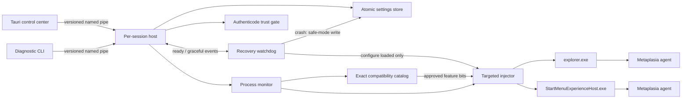

# Architecture

## Design goals

Metaplasia isolates unstable shell integration from its UI, applies changes
only to explicitly selected targets, and keeps every hook reversible. The
architecture assumes private Windows implementation details can change on any
cumulative update; compatibility is therefore a runtime decision, not a build
assumption.

## Responsibilities

### Control center

The Tauri window loads only static assets embedded in `metaplasia.exe`; there
is no development server or network service in a production build. JavaScript
invokes a narrow set of typed Rust commands. Blocking named-pipe transactions
and host startup run on Tauri's blocking worker pool, never on the WebView event
loop. The frontend polls immutable snapshots, updates existing DOM nodes, and
never owns process handles or injection details. Closing the UI does not stop
the host, so customizations do not depend on an open window.

The only outbound runtime network path is the portable update client. It reads
bounded assets from the project's GitHub Releases channel, verifies the
Ed25519-signed manifest before trusting its package metadata, and verifies the
complete ZIP SHA-256 before staging. Installation runs from a copied helper,
requires explicit user confirmation, stops the host through an acknowledged IPC
transaction, briefly restarts the current-session shell to release the agent
DLL, and replaces the exact five-file runtime with rollback copies. See
[Portable updates](UPDATES.md).

### Protocol and transport

The UI and CLI use a fixed little-endian binary protocol. Each frame contains a
magic value, protocol version, message kind, request ID, and bounded payload
length. Decoders reject invalid enum values, booleans, truncated fields,
trailing data, oversized payloads, and incompatible versions.

The host exposes one local named pipe per Windows session. It accepts one short
request/response transaction at a time. Clients retry the small interval during
which the single-instance pipe is recreated; commands are currently idempotent.
Any future non-idempotent command must add request-ID deduplication before it is
exposed.

### Host

The host owns desired state and is the only component allowed to invoke the
injector. It selects the Explorer instance owning `Shell_TrayWnd`, discovers
the Start menu host in the same session, detects process replacement, and
reapplies configuration after restart. A local mutex enforces one host per
session.

Settings changes are copied, atomically persisted, and only then published to
the monitor. Persistence and crash-loop safe-mode writes are serialized by the
same lock. Invalid settings never enable a feature.

The host also emits structured JSONL lifecycle, configuration, recovery, and
failure events to a bounded rotating log in LocalAppData. Logging is protected
by its own mutex and is fail-open, so filesystem failures cannot block the
controller. Repeated identical configuration failures are rate-limited while
the monitor continues its normal retry cadence. The Tauri diagnostics command
reads a fixed maximum byte count, validates schema and field bounds, ignores
malformed records, and exposes at most the newest 500 entries. See
[Diagnostics](DIAGNOSTICS.md).

Before reading settings, a new host waits for the prior session recovery lease.
It then launches a sibling watchdog with unguessable event names and does not
start the controller until the child validates the host identity, same-user
session, installation/data paths, opens the host process, acquires the recovery
lease, and signals readiness. If the watchdog exits while the host is running,
the host stops and performs its normal agent deactivation path.

Before launching that watchdog, the host verifies embedded Authenticode on
itself, the watchdog, and the agent. Production requires all three files to be
trusted by Windows and signed by one exact leaf certificate. The optional
resource-only compatibility pack must carry the same signer. The accepted
thumbprint is passed into the injector for a second agent check immediately
before a new load. See [Component trust](TRUST.md).

Each enabled adapter passes an independent compatibility decision before its
feature bit reaches the injector. The catalog requires an exact Windows build
and UBR plus exact PE/PDB identities read from the modules mapped in the target
process. A rejected Taskbar adapter does not block an independently approved
Explorer adapter sharing the same agent. Decisions refresh every 30 seconds;
an approval loss filters the active configuration back to safe feature bits.

### Injector

The injector uses `LoadLibraryW` only for an absolute, canonical DLL path. It
rejects a target unless all of these checks pass before loading the DLL:

- expected executable name for the requested adapter;
- same Windows user and interactive session;
- matching process architecture;
- not a protected process;
- valid, target-compatible agent ABI and feature mask;
- trusted agent signature matching the host's pinned publisher for a new load.

Before enabling a non-empty configuration, the injector also enumerates the
target's loaded modules and rejects exact known Windhawk and ExplorerPatcher
loader identities. It deliberately skips this policy for an empty
configuration so teardown cannot be blocked by a customizer loaded later.

Agent exports are resolved from the export directory of the PE image actually
mapped in the target. Every header, table, name, ordinal, and function RVA is
bounded by the snapshot image size, forwarded exports are rejected, and the
resolved RVA must belong to an executable section. The injector never combines
an RVA from a newly replaced on-disk DLL with an older loaded image. This also
allows an older agent to reject a newer fixed-size ABI safely instead of
calling an arbitrary address. Remote-thread timeouts never terminate the
thread or free memory it might still read; the exceptional allocation is left
for the target process to reclaim on exit.

The injector exposes a separate configure-only operation for teardown and
recovery. It revalidates the target and exact mapped agent but returns
`not_found` instead of calling `LoadLibraryW` if the module is absent. This
enforces the watchdog's no-new-injection invariant without relying on a
race-prone caller-side module check.

### Agent

`DllMain` only records its own module handle and disables thread attach
notifications. Initialization, hook transactions, reconfiguration, and
teardown happen through versioned exported entry points on an injector-created
thread. The ABI is fixed-size and contains no pointers.

The Taskbar path combines a `GetTimeFormatEx` hook filtered to known Taskbar
callers with exact XAML background, geometry, opacity, and visibility rules.
The optional capsule uses the live Taskbar width to calculate bounded outer
margins, rounds the native background, and insets the native System Tray. It
preserves the Win32 size-query contract, null terminator, buffer validation,
and original pass-through behavior. Disabling restores all owned XAML
properties before it removes the hook; the DLL may remain loaded harmlessly
until Explorer exits.

The File Explorer color adapter owns coordinated DWM caption attributes,
composition accent state, narrowly scoped DirectUI canvas painting, native
`SysTreeView32` background/text colors, themed DirectUI Details-header
surfaces, and exact WinUI 3 background properties discovered through the
in-box Windows App SDK diagnostics endpoint. Optional custom scrollbars use
same-thread subclasses and hit-transparent owned popups while preserving native
hit testing. The navigation tree uses Win32 scroll metrics; the DirectUI file
area consumes event-driven UI Automation Scroll metrics from `UIItemsView`.
Header interception is restricted by the
tracked Explorer UI thread, DPI-scaled header geometry, and the observed
header theme handle. It preserves the native frame so DWM retains the system
caption glyphs. Disable restores captured TreeView colors and WinUI brushes,
disables the accent, and applies `DWMWA_COLOR_DEFAULT` to the caption
attributes; agent teardown also detaches the subclass.
The title hook intercepts `SetWindowTextW` only for top-level Explorer
window classes owned by the current process. The host discovers every process
that owns a `CabinetWClass` or `ExploreWClass` window and never injects unrelated
Explorer factory processes. The agent uses bounded stack buffers and a
fixed-capacity ownership table. Titles which already contain the configured
prefix are not claimed; an external already-prefixed update releases ownership.
Disable and prefix replacement restore only titles that Metaplasia still owns.

The Start menu path is a separate adapter. It dynamically calls the standard
`InitializeXamlDiagnosticsEx` export from the already-loaded
`Windows.UI.Xaml.dll`, exposes a dedicated COM TAP class factory, and subscribes
an `IVisualTreeServiceCallback2` through `IVisualTreeService3`. TAP activation
and visual-tree subscription are synchronized with a bounded readiness event
because `SetSite` is asynchronous on current Windows 11 builds. A visual is
modified only when its reported type exactly matches the compatibility
allowlist and it supports the public `Windows.UI.Xaml.IUIElement` ABI. The
original opacity, visibility, or brush is retained in a bounded table; changes and
restoration execute on the XAML dispatcher. Disabling first restores tracked
elements and then removes the visual-tree subscription.

## Target model

Taskbar uses only the `explorer.exe` that owns `Shell_TrayWnd`. File Explorer
uses whichever same-session `explorer.exe` processes currently own folder
windows; if that includes the shell process, both feature masks are combined in
one agent configuration. Start uses a separate agent in
`StartMenuExperienceHost.exe`. Each process receives at most one Metaplasia DLL.

Current target maturity:

| Target | Discovery | Injection adapter | Visual customization |
|---|---:|---:|---:|
| Taskbar | implemented | implemented | responsive capsule, independent solid color, clock prefix, opacity, three visibility rules |
| File Explorer | implemented | implemented | independent full-window color, multi-process owned title prefix |
| Start menu | implemented | implemented | independent solid color, opacity and Recommended visibility |

The catalog currently certifies one exact Windows 11 25H2 revision. This is a
functional compatibility mechanism, not yet a broad Windows support matrix.

## Recovery behavior

When a configured target PID disappears, the host records an unexpected exit.
Three exits inside 60 seconds atomically disable the associated settings:
Explorer disables Taskbar and File Explorer together; Start menu is isolated.
Re-enabling a target explicitly clears its crash history.

A normal host shutdown sends an empty configuration to every known loaded
agent, then signals the graceful event. On ungraceful process termination, the
watchdog writes an all-disabled settings snapshot before enumerating supported
same-session shell processes. It sends an empty configuration only through the
injector's configure-only path and only when the exact installed agent path is
already mapped.

The watchdog does not unload modules, terminate or restart shell processes, or
inject into a clean process. A loaded agent can therefore remain mapped but
inert until its shell process exits. Its recovery lease prevents a replacement
host from reading stale enabled settings while recovery is in progress. See
[Recovery behavior](RECOVERY.md).

## Adding a customization

1. Define a versioned feature bit and fixed-size configuration data.
2. Add a Windows-build compatibility predicate; default to unsupported.
3. Implement target-specific discovery without choosing an arbitrary process.
4. Resolve private symbols outside the target process and cache them by module
   identity, Windows build, architecture, and PDB signature.
5. Validate the resolved address belongs to the expected executable section.
6. Install all hooks as a transaction; roll back the transaction on failure.
7. Implement configuration updates and complete teardown before exposing UI.
8. Add codec/state tests and run crash/restart tests in a disposable VM.

The host, transport, and injector must remain independent of feature-specific
hook code. New UI settings should describe desired state; they must not contain
process handles, raw addresses, or symbol details.

## Symbol compatibility pipeline

The `symbols` library parses PE files without executing them and builds an exact
identity from machine type, COFF timestamp, image size, checksum, and RSDS PDB
GUID+age. DbgHelp calls are process-global and therefore protected by one mutex.
A result is accepted only when its RVA belongs to the image and an executable
section. The first 32 on-disk code bytes are hashed with SHA-256 so a future
compatibility allowlist can reject a symbol whose implementation changed even
when a name still resolves.

Resolution is local-only at this stage. It searches the module directory and an
exact downstream-cache leaf. Populating that cache and approving compatibility
remain explicit offline operations, separate from host startup. See
[Symbols and compatibility](SYMBOLS.md).
